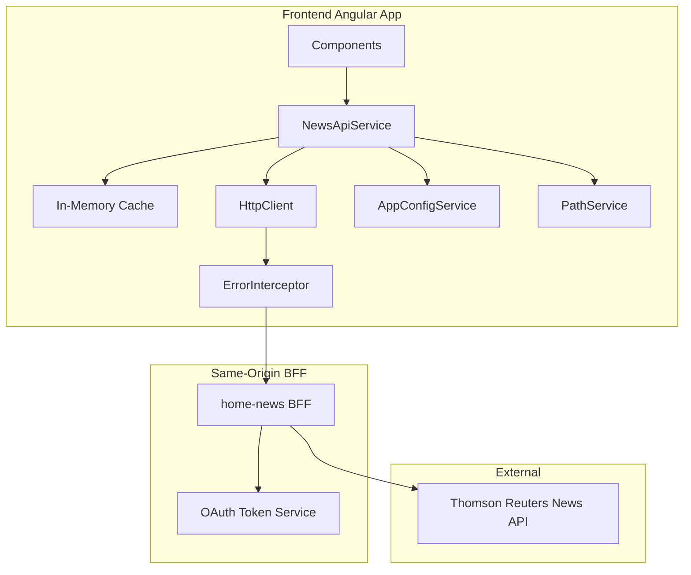
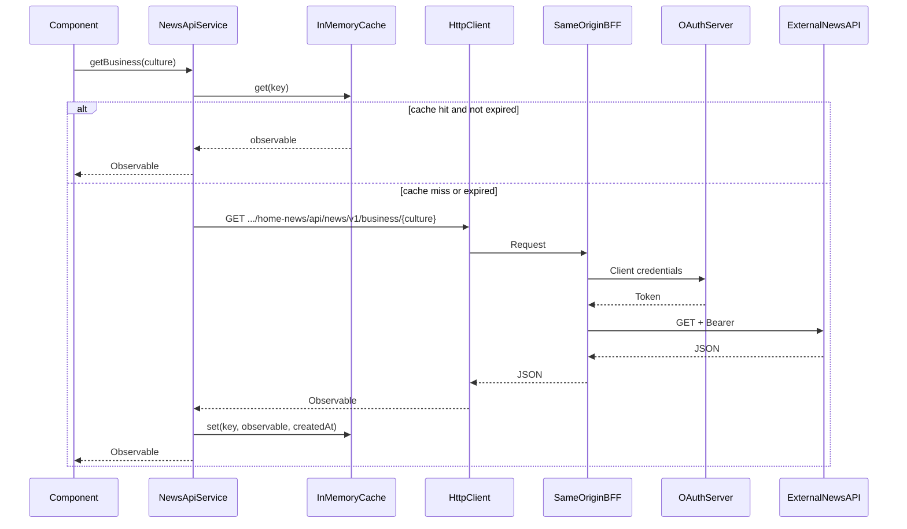

# Mermaid in Markdown github

## High-level architecture

### Architecture diagram

```mermaid
flowchart TB
  subgraph frontend [Frontend Angular App]
    Component[Components]
    NewsApiService[NewsApiService]
    Cache[In-Memory Cache]
    HttpClient[HttpClient]
    ErrorInterceptor[ErrorInterceptor]
    AppConfig[AppConfigService]
    PathService[PathService]
    Component --> NewsApiService
    NewsApiService --> Cache
    NewsApiService --> HttpClient
    NewsApiService --> AppConfig
    NewsApiService --> PathService
    HttpClient --> ErrorInterceptor
  end
  subgraph backend [Same-Origin BFF]
    BFF[home-news BFF]
    Auth[OAuth Token Service]
    BFF --> Auth
  end
  subgraph external [External]
    NewsAPI[Thomson Reuters News API]
  end
  ErrorInterceptor --> BFF
  BFF --> NewsAPI
```

### Request flow (sequence)

```mermaid
sequenceDiagram
  participant UI as Component
  participant NewsSvc as NewsApiService
  participant Cache as InMemoryCache
  participant Http as HttpClient
  participant BFF as SameOriginBFF
  participant Auth as OAuthServer
  participant NewsAPI as ExternalNewsAPI

  UI->>NewsSvc: getBusiness(culture)
  NewsSvc->>Cache: get(key)
  alt cache hit and not expired
    Cache-->>NewsSvc: observable
    NewsSvc-->>UI: Observable
  else cache miss or expired
    NewsSvc->>Http: GET .../home-news/api/news/v1/business/{culture}
    Http->>BFF: Request
    BFF->>Auth: Client credentials
    Auth-->>BFF: Token
    BFF->>NewsAPI: GET + Bearer
    NewsAPI-->>BFF: JSON
    BFF-->>Http: JSON
    Http-->>NewsSvc: Observable
    NewsSvc->>Cache: set(key, observable, createdAt)
    NewsSvc-->>UI: Observable
  end
```
